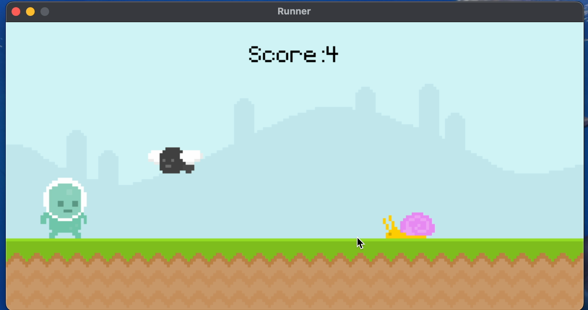

# Platformer Game - README
## How to Run the Game
1. **Install Python**  
   Download and install Python from [python.org](https://www.python.org/downloads/) if you don't have it installed already.
2. **Install Pygame-ce**  
   To install the required Pygame-ce library, open your terminal or command prompt and run the following command:  
   `pip install pygame-ce`
3. **Run the Game**  
   Once Python and Pygame-ce are installed, run the game by executing the `main.py` script:  
   `python main.py`
   Or just simply open the `main.py` file

## Technology Stack
- **Pygame-ce**: A Python library for creating 2D games, used for rendering, handling player input, and game mechanics in this platformer game.

## Notes
- Ensure that you have Python 3.6 or above installed.
- If you encounter any issues during installation, ensure that `pip` is updated:  
  `python -m pip install --upgrade pip`

